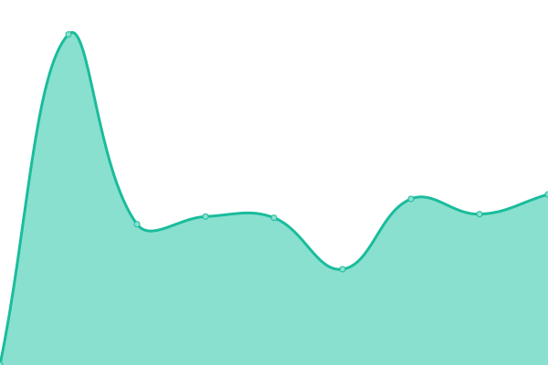

# [📈 Live Status](https://sdpfnsflkgnpisoqdgs.github.io/qmdslfjlskdngpisdg): <!--live status--> **🟧 Partial outage**

This repository contains the open-source uptime monitor and status page for [sdpfnsflkgnpisoqdgs](https://sdpfnsflkgnpisoqdgs.github.io/qmdslfjlskdngpisdg), powered by [Upptime](https://github.com/upptime/upptime).

With [Upptime](https://upptime.js.org), you can get your own unlimited and free uptime monitor and status page, powered entirely by a GitHub repository. We use [Issues](https://github.com/sdpfnsflkgnpisoqdgs/qmdslfjlskdngpisdg/issues) as incident reports, [Actions](https://github.com/sdpfnsflkgnpisoqdgs/qmdslfjlskdngpisdg/actions) as uptime monitors, and [Pages](https://sdpfnsflkgnpisoqdgs.github.io/qmdslfjlskdngpisdg) for the status page.

<!--start: status pages-->
<!-- This summary is generated by Upptime (https://github.com/upptime/upptime) -->
<!-- Do not edit this manually, your changes will be overwritten -->
<!-- prettier-ignore -->
| URL | Status | History | Response Time | Uptime |
| --- | ------ | ------- | ------------- | ------ |
|  [L'Ingénu](https://lingenu.org) | 🟩 Up | [l-ingenu.yml](https://github.com/sdpfnsflkgnpisoqdgs/qmdslfjlskdngpisdg/commits/HEAD/history/l-ingenu.yml) | 

 468ms
     
 | 

<a href="https://sdpfnsflkgnpisoqdgs.github.io/qmdslfjlskdngpisdg/history/l-ingenu">100.00%</a>
    

|  [L'Ingénu API Banner](https://api.lingenu.org/api/homeBanner) | 🟥 Down | [l-ingenu-api-banner.yml](https://github.com/sdpfnsflkgnpisoqdgs/qmdslfjlskdngpisdg/commits/HEAD/history/l-ingenu-api-banner.yml) | 

 0ms
     
 | 

<a href="https://sdpfnsflkgnpisoqdgs.github.io/qmdslfjlskdngpisdg/history/l-ingenu-api-banner">0.00%</a>
    

|  [My Future Training](https://my-future-training.com) | 🟥 Down | [my-future-training.yml](https://github.com/sdpfnsflkgnpisoqdgs/qmdslfjlskdngpisdg/commits/HEAD/history/my-future-training.yml) | 

 0ms
     
 | 

<a href="https://sdpfnsflkgnpisoqdgs.github.io/qmdslfjlskdngpisdg/history/my-future-training">0.00%</a>
    

|  [Morf-in or PilgrRim](https://morf-in.com) | 🟩 Up | [morf-in-or-pilgr-rim.yml](https://github.com/sdpfnsflkgnpisoqdgs/qmdslfjlskdngpisdg/commits/HEAD/history/morf-in-or-pilgr-rim.yml) | 

 420ms
     
 | 

<a href="https://sdpfnsflkgnpisoqdgs.github.io/qmdslfjlskdngpisdg/history/morf-in-or-pilgr-rim">100.00%</a>
    

|  RtArthur.vue | 🟩 Up | [rt-arthur-vue.yml](https://github.com/sdpfnsflkgnpisoqdgs/qmdslfjlskdngpisdg/commits/HEAD/history/rt-arthur-vue.yml) | 

 3977ms
     
 | 

<a href="https://sdpfnsflkgnpisoqdgs.github.io/qmdslfjlskdngpisdg/history/rt-arthur-vue">100.00%</a>
    

|  API dev | 🟥 Down | [api-dev.yml](https://github.com/sdpfnsflkgnpisoqdgs/qmdslfjlskdngpisdg/commits/HEAD/history/api-dev.yml) | 

 430ms
     
 | 

<a href="https://sdpfnsflkgnpisoqdgs.github.io/qmdslfjlskdngpisdg/history/api-dev">84.57%</a>
    

|  APP | 🟩 Up | [app.yml](https://github.com/sdpfnsflkgnpisoqdgs/qmdslfjlskdngpisdg/commits/HEAD/history/app.yml) | 

 597ms
     
 | 

<a href="https://sdpfnsflkgnpisoqdgs.github.io/qmdslfjlskdngpisdg/history/app">100.00%</a>
    

|  [arthurplazanet empty](https://arthurplazanet.com) | 🟩 Up | [arthurplazanet-empty.yml](https://github.com/sdpfnsflkgnpisoqdgs/qmdslfjlskdngpisdg/commits/HEAD/history/arthurplazanet-empty.yml) | 

 424ms
     
 | 

<a href="https://sdpfnsflkgnpisoqdgs.github.io/qmdslfjlskdngpisdg/history/arthurplazanet-empty">100.00%</a>
    

|  [This website](https://sdpfnsflkgnpisoqdgs.github.io/qmdslfjlskdngpisdg/) | 🟩 Up | [this-website.yml](https://github.com/sdpfnsflkgnpisoqdgs/qmdslfjlskdngpisdg/commits/HEAD/history/this-website.yml) | 

 82ms
     
 | 

<a href="https://sdpfnsflkgnpisoqdgs.github.io/qmdslfjlskdngpisdg/history/this-website">100.00%</a>
    

<!--end: status pages-->

[**Visit our status website →**](https://sdpfnsflkgnpisoqdgs.github.io/qmdslfjlskdngpisdg)

## 📄 License

- Powered by: [Upptime](https://github.com/upptime/upptime)
- Code: [MIT](./LICENSE) © [sdpfnsflkgnpisoqdgs](https://sdpfnsflkgnpisoqdgs.github.io/qmdslfjlskdngpisdg)
- Data in the `./history` directory: [Open Database License](https://opendatacommons.org/licenses/odbl/1-0/)
